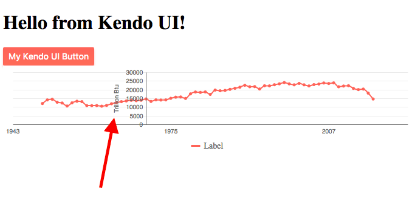

# Kendo UI Chart Axis Issues

This is simple example that shows KendoUI charts issues with dates `< 1970`. 
The axis of the graph is in the center of chart and passes through the name/title of the axis and it looks so so :)
 


### Component

* `src/app/app.component.ts`

```javascript

import { Component } from '@angular/core';

@Component({
  selector: 'app-root',
  templateUrl: './app.component.html',
  styleUrls: ['./app.component.css']
})
export class AppComponent {
  title = 'app works!';

  data:any[] = [["1949-01-01T00:00:00.000Z",11973.882],["1950-01-01T00:00:00.000Z",14060.135],["1951-01-01T00:00:00.000Z",14419.325],["1952-01-01T00:00:00.000Z",12734.313],["1953-01-01T00:00:00.000Z",12277.746],["1954-01-01T00:00:00.000Z",10542.448],["1955-01-01T00:00:00.000Z",12369.608],["1956-01-01T00:00:00.000Z",13306.334],["1957-01-01T00:00:00.000Z",13061.393],["1958-01-01T00:00:00.000Z",10783.088],["1959-01-01T00:00:00.000Z",10777.984],["1960-01-01T00:00:00.000Z",10817.398],["1961-01-01T00:00:00.000Z",10447.091],["1962-01-01T00:00:00.000Z",10900.56],["1963-01-01T00:00:00.000Z",11849.229],["1964-01-01T00:00:00.000Z",12523.881],["1965-01-01T00:00:00.000Z",13055.285],["1966-01-01T00:00:00.000Z",13467.679],["1967-01-01T00:00:00.000Z",13825.487],["1968-01-01T00:00:00.000Z",13608.678],["1969-01-01T00:00:00.000Z",13863.346],["1970-01-01T00:00:00.000Z",14607.064],["1971-01-01T00:00:00.000Z",13185.523],["1972-01-01T00:00:00.000Z",14091.685],["1973-01-01T00:00:00.000Z",13992.126],["1974-01-01T00:00:00.000Z",14074.451],["1975-01-01T00:00:00.000Z",14989.315],["1976-01-01T00:00:00.000Z",15653.687],["1977-01-01T00:00:00.000Z",15754.741],["1978-01-01T00:00:00.000Z",14909.809],["1979-01-01T00:00:00.000Z",17539.583],["1980-01-01T00:00:00.000Z",18597.726],["1981-01-01T00:00:00.000Z",18376.773],["1982-01-01T00:00:00.000Z",18638.773],["1983-01-01T00:00:00.000Z",17246.671],["1984-01-01T00:00:00.000Z",19719.216],["1985-01-01T00:00:00.000Z",19325.166],["1986-01-01T00:00:00.000Z",19509.466],["1987-01-01T00:00:00.000Z",20141.104],["1988-01-01T00:00:00.000Z",20737.639],["1989-01-01T00:00:00.000Z",21360.178],["1990-01-01T00:00:00.000Z",22487.548],["1991-01-01T00:00:00.000Z",21636.424],["1992-01-01T00:00:00.000Z",21694.132],["1993-01-01T00:00:00.000Z",20335.654],["1994-01-01T00:00:00.000Z",22202.083],["1995-01-01T00:00:00.000Z",22129.55],["1996-01-01T00:00:00.000Z",22790.148],["1997-01-01T00:00:00.000Z",23309.614],["1998-01-01T00:00:00.000Z",24045.198],["1999-01-01T00:00:00.000Z",23295.084],["2000-01-01T00:00:00.000Z",22735.478],["2001-01-01T00:00:00.000Z",23547.08],["2002-01-01T00:00:00.000Z",22732.237],["2003-01-01T00:00:00.000Z",22093.652],["2004-01-01T00:00:00.000Z",22852.099],["2005-01-01T00:00:00.000Z",23185.189],["2006-01-01T00:00:00.000Z",23789.51],["2007-01-01T00:00:00.000Z",23492.742],["2008-01-01T00:00:00.000Z",23851.368],["2009-01-01T00:00:00.000Z",21623.721],["2010-01-01T00:00:00.000Z",22038.226],["2011-01-01T00:00:00.000Z",22221.407],["2012-01-01T00:00:00.000Z",20676.893],["2013-01-01T00:00:00.000Z",20001.304],["2014-01-01T00:00:00.000Z",20285.705],["2015-01-01T00:00:00.000Z",17946.095],["2016-01-01T00:00:00.000Z",14577.843]];

  onButtonClick() {
    this.title = 'Hello from Kendo UI!';
  }
}
```

* `src/app/app.component.html`

```html
<h1>{{title}}</h1>

<button kendoButton (click)="onButtonClick()" [primary]="true">My Kendo UI Button</button>

<kendo-chart *ngIf="data" [style.width.%]="100" [style.height.%]="100">
  <kendo-chart-axis-defaults
    [majorTicks]="{visible: false}"
    [line]="{ color: '#656565' }">
    <kendo-chart-axis-defaults-labels font="10px sans-serif">
    </kendo-chart-axis-defaults-labels>
  </kendo-chart-axis-defaults>

  <kendo-chart-title [text]="data.title"
                     color="#656565"
                     font="14px Helvetica, Arial, sans-serif">
  </kendo-chart-title>

  <kendo-chart-legend position="bottom" orientation="horizontal"></kendo-chart-legend>

  <kendo-chart-tooltip>
    <ng-template kendoChartSeriesTooltipTemplate let-value="value">
      <b>{{value.x | date}}:</b><br>{{value.y.toFixed(2)}}
    </ng-template>
  </kendo-chart-tooltip>

  <kendo-chart-x-axis>
    <kendo-chart-x-axis-item
      [type]="'date'"
      [labels]="{step: 2}"
      [majorGridLines]="{visible: false}">
    </kendo-chart-x-axis-item>
  </kendo-chart-x-axis>

  <kendo-chart-y-axis>
    <kendo-chart-y-axis-item
      [title]="{
              text: 'Trillion Btu',
              position: 'center',
              margin: 5,
              padding: 0,
              font: '10px bold Helvetica, Arial, sans-serif'
            }"
      [type]="'numeric'"
    >

    </kendo-chart-y-axis-item>
  </kendo-chart-y-axis>

  <kendo-chart-series>
    <kendo-chart-series-item
      type="scatterLine"
      [style]="'smooth'"
      [markers]="{size: 3}"
      [width]="2"
      [data]="data"
      [name]="'Label'">
    </kendo-chart-series-item>
  </kendo-chart-series>

</kendo-chart>
```
